# ExternalDNS Manager Sequence Diagram

```mermaid
sequenceDiagram
    participant Main as Main Process
    participant API as API Server
    participant TrueUp as TrueUp Loop
    participant PowerDNS as PowerDNS Server
    participant ExtDNS as ExternalDNS
    
    %% Initialization
    Note over Main: Startup & Initialization
    Main->>Main: Parse flags & setup logging
    Main->>Main: Setup HTTP client (retryable)
    Main->>Main: Create PowerDNS client
    Main->>API: Start API server (port 8081)
    activate API
    Main->>TrueUp: Start doLoop() goroutine
    activate TrueUp
    Main->>TrueUp: Send initial trigger (trueUpRunNow)
    
    %% API Health Endpoints
    rect rgb(240, 240, 255)
        Note over API: Health Check Endpoints
        API-->>API: GET /v1/liveness (204)
        API-->>API: GET /v1/readiness (204)
    end
    
    %% External DNS Creates Records
    rect rgb(255, 250, 240)
        Note over ExtDNS,PowerDNS: ExternalDNS Operation (Background)
        Note over ExtDNS: Kubernetes Service/Ingress<br/>with external-dns annotation
        ExtDNS->>PowerDNS: Create A record (e.g., service.domain.com)
        PowerDNS-->>ExtDNS: A record created
        ExtDNS->>PowerDNS: Create TXT record with heritage=external-dns
        PowerDNS-->>ExtDNS: TXT record created
        Note over PowerDNS: A: service.domain.com -> 10.20.30.40<br/>TXT: a-service.domain.com "heritage=external-dns..."
    end
    
    %% Main True-Up Loop
    loop Every trueUpSleepInterval seconds (default: 30s)
        Note over TrueUp: True-Up Cycle Start
        TrueUp->>TrueUp: Set trueUpInProgress = true
        
        %% Data Collection Phase
        rect rgb(255, 250, 240)
            Note over TrueUp,PowerDNS: Phase 1: Fetch All Zones
            TrueUp->>PowerDNS: GET /api/v1/servers/localhost/zones
            PowerDNS-->>TrueUp: Return zones[]
            loop For each zone
                TrueUp->>PowerDNS: GET /api/v1/servers/localhost/zones/{zone}
                PowerDNS-->>TrueUp: Return zone with RRsets[]
            end
            TrueUp->>TrueUp: Build zoneRRSetMap for efficient lookup
            TrueUp->>TrueUp: Initialize actionableRRSetMap (zone -> RRsets)
        end
        
        %% Processing Phase
        rect rgb(240, 255, 240)
            Note over TrueUp: Phase 2: Process TXT Records
            loop For each zone
                loop For each RRset in zone
                    alt RRset.Type == TXT
                        alt Contains "heritage=external-dns"
                            Note over TrueUp: Case 1: ExternalDNS Record
                            TrueUp->>TrueUp: ProcessExternalDNSRecord()
                            
                            rect rgb(250, 250, 255)
                                Note over TrueUp: Strip "a-" prefix if present
                                TrueUp->>TrueUp: Find corresponding A record
                                
                                alt A record found
                                    TrueUp->>TrueUp: Extract IP address
                                    TrueUp->>TrueUp: Calculate reverse zone name
                                    
                                    alt Reverse zone exists
                                        TrueUp->>TrueUp: Build PTR record (IP -> hostname)
                                        TrueUp->>TrueUp: Build TXT record with "externaldns-manager" signature
                                        
                                        alt Record not duplicate AND not already exists
                                            TrueUp->>TrueUp: Add PTR & TXT to patchRRSets[]
                                            Note over TrueUp: PTR: 40.30.20.10.in-addr.arpa -> service.domain.com<br/>TXT: 40.30.20.10.in-addr.arpa "externaldns-manager/service.domain.com"
                                        else Record duplicate or exists
                                            Note over TrueUp: Skip to prevent conflicts<br/>(multiple services -> same IP)
                                        end
                                    else Reverse zone missing
                                        Note over TrueUp: Log error, skip record
                                    end
                                else A record not found
                                    Note over TrueUp: Cannot process, skip
                                end
                            end
                            
                        else Contains "externaldns-manager"
                            Note over TrueUp: Case 2: Manager-Owned Record
                            TrueUp->>TrueUp: ProcessManagerRecord()
                            
                            rect rgb(250, 250, 255)
                                TrueUp->>TrueUp: Find associated PTR record
                                
                                alt PTR record found
                                    TrueUp->>TrueUp: Extract hostname from PTR
                                    TrueUp->>TrueUp: Calculate forward IP from PTR name
                                    
                                    loop Search all zones for A record
                                        alt A record found with matching IP
                                            Note over TrueUp: A record still exists<br/>Do nothing
                                        end
                                    end
                                    
                                    alt No matching A record found
                                        Note over TrueUp: A record deleted (stale PTR/TXT)
                                        TrueUp->>TrueUp: Mark PTR for deletion
                                        TrueUp->>TrueUp: Mark TXT for deletion
                                        TrueUp->>TrueUp: Add to patchRRSets[]
                                    end
                                    
                                else PTR record not found
                                    Note over TrueUp: Orphaned TXT record
                                    TrueUp->>TrueUp: Mark TXT for deletion
                                    TrueUp->>TrueUp: Add to patchRRSets[]
                                end
                            end
                            
                        else No ExternalDNS or Manager signature
                            Note over TrueUp: Unmanaged record, ignore
                        end
                    end
                end
            end
        end
        
        %% Reconciliation Phase
        rect rgb(240, 255, 255)
            Note over TrueUp,PowerDNS: Phase 3: Apply Changes
            TrueUp->>TrueUp: Group patchRRSets by zone
            Note over TrueUp: Organize changes into actionableRRSetMap
            
            loop For each zone with changes
                alt actionableRRSetMap[zone] has RRsets
                    TrueUp->>PowerDNS: PATCH /api/v1/servers/localhost/zones/{zone}
                    Note over TrueUp,PowerDNS: Single API call with all changes:<br/>- Add new PTR/TXT (ChangeType: REPLACE)<br/>- Delete stale PTR/TXT (ChangeType: DELETE)
                    
                    alt Patch successful
                        PowerDNS-->>TrueUp: Changes applied
                        Note over TrueUp: Log success
                    else Patch failed
                        PowerDNS-->>TrueUp: Error response
                        Note over TrueUp: Log error, continue
                    end
                else No changes for zone
                    Note over TrueUp: Skip zone
                end
            end
        end
        
        TrueUp->>TrueUp: Set trueUpInProgress = false
        Note over TrueUp: Sleep until next cycle or trigger
    end
    
    %% Manual Trigger via API
    rect rgb(255, 255, 240)
        Note over API,TrueUp: Manual Trigger (Optional)
        API->>API: POST /v1/manager/jobs
        alt trueUpInProgress == true
            API-->>API: Return 503 (Service Unavailable)
        else trueUpInProgress == false
            API->>TrueUp: Send trigger (trueUpRunNow)
            API-->>API: Return 204 (No Content)
            Note over TrueUp: Immediately starts true-up cycle
        end
    end
    
    %% ExternalDNS Deletion Scenario
    rect rgb(255, 240, 240)
        Note over ExtDNS,PowerDNS: ExternalDNS Deletion (Background)
        Note over ExtDNS: Service/Ingress removed<br/>or annotation removed
        ExtDNS->>PowerDNS: Delete A record
        PowerDNS-->>ExtDNS: A record deleted
        ExtDNS->>PowerDNS: Delete TXT record
        PowerDNS-->>ExtDNS: TXT record deleted
        
        Note over TrueUp: Next true-up cycle detects<br/>missing A record
        TrueUp->>TrueUp: ProcessManagerRecord() finds no A record
        TrueUp->>PowerDNS: PATCH zone (delete PTR & TXT)
        PowerDNS-->>TrueUp: Stale records cleaned up
    end
    
    %% Shutdown
    rect rgb(255, 240, 255)
        Note over Main,TrueUp: Graceful Shutdown (SIGINT/SIGTERM)
        Main->>Main: Receive signal
        Main->>Main: Set Running = false
        Main->>TrueUp: Send trueUpShutdown
        Main->>API: Shutdown API server (5s timeout)
        deactivate API
        TrueUp->>TrueUp: Exit loop
        deactivate TrueUp
        Main->>Main: Wait for all goroutines
        Note over Main: Process exits
    end
```

## Key Components

### Main Process
- Initializes logging and HTTP client with retry logic
- Creates PowerDNS client for API interactions
- Manages goroutines and graceful shutdown

### API Server (Port 8081)
- **GET /v1/liveness**: Health check endpoint (returns 204)
- **GET /v1/readiness**: Readiness check endpoint (returns 204)
- **POST /v1/manager/jobs**: Manually trigger true-up cycle (returns 204 or 503)

### True-Up Loop
Runs every 30 seconds (configurable via `-true_up_sleep_interval`) and performs 3 phases:

1. **Fetch All Zones**: Retrieve all DNS zones and their RRsets from PowerDNS
2. **Process TXT Records**: Handle two types of records:
   - **ExternalDNS Records**: Create corresponding PTR and TXT records
   - **Manager-Owned Records**: Validate and clean up stale records
3. **Apply Changes**: Batch all changes per zone into single PATCH requests

## Record Types

### ExternalDNS Records (Created by ExternalDNS)
- **A Record**: `service.domain.com` → `10.20.30.40`
- **TXT Record**: `a-service.domain.com` → `"heritage=external-dns..."`
  - Note: ExternalDNS v0.12+ prefixes TXT record names with `a-`

### Manager-Owned Records (Created by ExternalDNS Manager)
- **PTR Record**: `40.30.20.10.in-addr.arpa` → `service.domain.com`
- **TXT Record**: `40.30.20.10.in-addr.arpa` → `"externaldns-manager/service.domain.com"`

## Processing Logic

### Case 1: ExternalDNS Record Found
1. Strip `a-` prefix from TXT record name (if present)
2. Find corresponding A record with matching name
3. Extract IP address from A record
4. Calculate reverse zone name from IP
5. Verify reverse zone exists
6. Check for duplicates (multiple services → same IP)
7. Check if PTR already exists (avoid conflicts with cray-powerdns-manager)
8. If all checks pass, create PTR + TXT records

### Case 2: Manager-Owned Record Found
1. Find associated PTR record (same name as TXT)
2. Extract hostname from PTR record content
3. Calculate forward IP from PTR record name
4. Search all zones for matching A record
5. If A record exists: do nothing (record still valid)
6. If A record missing: mark PTR + TXT for deletion (stale)
7. If PTR missing: mark orphaned TXT for deletion

## Key Features

### Duplicate Prevention
- Prevents multiple PTR records for the same IP
- Common scenario: multiple services use same LoadBalancer IP
- Only first service creates the PTR record

### Conflict Avoidance
- Checks if PTR record already exists before creating
- Avoids conflicts with cray-powerdns-manager (SLS-based records)
- If record exists, skips creation (let other manager win)

### Stale Record Cleanup
- Automatically detects when ExternalDNS removes A records
- Cleans up corresponding PTR and TXT records in reverse zones
- Handles orphaned TXT records (PTR deleted externally)

### Error Handling
- Retryable HTTP client with exponential backoff
- Continues processing even if individual records fail
- Logs errors but doesn't halt true-up cycle

## Configuration

- **pdns_url**: PowerDNS API URL (default: `http://localhost:9090`)
- **pdns_api_key**: PowerDNS API key (default: `cray`)
- **true_up_sleep_interval**: Seconds between cycles (default: `30`)

## Notes

- ExternalDNS v0.12+ changed TXT record format (adds `a-` prefix)
- Manager maintains TXT records with `externaldns-manager/` signature for tracking
- All changes per zone are batched into single PATCH request for efficiency
- Manager only manages reverse DNS (PTR) records based on ExternalDNS forward (A) records
