# PowerDNS Manager Sequence Diagram

```mermaid
sequenceDiagram
    participant Main as Main Process
    participant API as API Server
    participant TrueUp as TrueUp Loop
    participant SLS as SLS (System Layout)
    participant HSM as HSM (State Manager)
    participant PowerDNS as PowerDNS Server
    
    %% Initialization
    Note over Main: Startup & Initialization
    Main->>Main: Parse flags & setup logging
    Main->>Main: Setup HTTP client & PowerDNS client
    Main->>Main: Parse DNSSEC/TSIG keys
    Main->>PowerDNS: Add/Update TSIG keys
    Main->>API: Start API server (port 8080)
    activate API
    Main->>TrueUp: Start trueUpDNS() goroutine
    activate TrueUp
    Main->>TrueUp: Send initial trigger (trueUpRunNow)
    
    %% API Health Endpoints
    rect rgb(240, 240, 255)
        Note over API: Health Check Endpoints
        API-->>API: GET /v1/liveness (204)
        API-->>API: GET /v1/readiness (204)
    end
    
    %% Main True-Up Loop
    loop Every trueUpSleepInterval seconds (default: 30s)
        Note over TrueUp: True-Up Cycle Start
        TrueUp->>TrueUp: Set trueUpInProgress = true
        
        %% Data Collection Phase
        rect rgb(255, 250, 240)
            Note over TrueUp,HSM: Phase 1: Data Collection
            TrueUp->>SLS: GET /v1/networks
            SLS-->>TrueUp: Return networks[]
            TrueUp->>SLS: GET /v1/hardware
            SLS-->>TrueUp: Return hardware[]
            TrueUp->>HSM: GET /hsm/v2/Inventory/EthernetInterfaces
            HSM-->>TrueUp: Return ethernetInterfaces[]
            TrueUp->>HSM: GET /hsm/v2/State/Components
            HSM-->>TrueUp: Return stateComponents[]
        end
        
        %% Zone Management Phase
        rect rgb(240, 255, 240)
            Note over TrueUp,PowerDNS: Phase 2: Zone Management
            TrueUp->>TrueUp: trueUpMasterZones(baseDomain, networks, nameservers)
            loop For each network
                TrueUp->>PowerDNS: GET /api/v1/servers/localhost/zones/{zone}
                alt Zone doesn't exist
                    PowerDNS-->>TrueUp: 404 Not Found
                    TrueUp->>PowerDNS: POST /api/v1/servers/localhost/zones (create zone)
                    PowerDNS-->>TrueUp: Zone created
                else Zone exists
                    PowerDNS-->>TrueUp: Return zone
                end
            end
            TrueUp->>TrueUp: trueUpReverseZones(networks, nameservers)
            loop For each network reverse zone
                TrueUp->>PowerDNS: GET /api/v1/servers/localhost/zones/{reverse-zone}
                alt Zone doesn't exist
                    PowerDNS-->>TrueUp: 404 Not Found
                    TrueUp->>PowerDNS: POST /api/v1/servers/localhost/zones (create reverse zone)
                    PowerDNS-->>TrueUp: Reverse zone created
                else Zone exists
                    PowerDNS-->>TrueUp: Return reverse zone
                end
            end
        end
        
        %% RRSet Building Phase
        rect rgb(255, 240, 240)
            Note over TrueUp: Phase 3: Build Desired State (RRSets)
            TrueUp->>TrueUp: buildStaticForwardRRSets(networks, hardware, stateComponents)
            Note over TrueUp: Creates A records from SLS<br/>+ addOwnershipComment()
            TrueUp->>TrueUp: buildStaticReverseRRSets(networks, reverseZone)
            Note over TrueUp: Creates PTR records from SLS<br/>+ addOwnershipComment()
            TrueUp->>TrueUp: buildDynamicForwardRRsets(hardware, networks, ethernetInterfaces)
            Note over TrueUp: Creates A & CNAME records from HSM<br/>+ addOwnershipComment()
            TrueUp->>TrueUp: buildDynamicReverseRRSets(networks, ethernetInterfaces)
            Note over TrueUp: Creates reverse PTR records from HSM<br/>+ addOwnershipComment()
            TrueUp->>TrueUp: Merge all RRSets into finalRRSet[]
        end
        
        %% Reconciliation Phase
        rect rgb(240, 255, 255)
            Note over TrueUp,PowerDNS: Phase 4: Reconcile (trueUpRRSets)
            TrueUp->>TrueUp: Build desiredRRSetMap from finalRRSet[]
            TrueUp->>TrueUp: Build zoneRRsetMap from existing zones
            
            Note over TrueUp: Case 1: RRset doesn't exist
            loop For each desired RRset not in DNS
                TrueUp->>TrueUp: Add to patch list (ChangeType: REPLACE)
            end
            
            Note over TrueUp: Case 2: RRset exists but incorrect
            loop For each desired RRset with different records
                TrueUp->>TrueUp: Add to patch list (ChangeType: REPLACE)
            end
            
            Note over TrueUp: Case 3: RRset missing ownership comment
            loop For each RRset without manager comment
                TrueUp->>TrueUp: Add to patch list with comment (ChangeType: REPLACE)
            end
            
            Note over TrueUp: Case 4: RRset should be deleted
            loop For each existing RRset not in desired state
                alt Is system record (SOA/NS)
                    TrueUp->>TrueUp: Skip deletion
                else Has ownership comment
                    TrueUp->>TrueUp: Add to patch list (ChangeType: DELETE)
                    Note over TrueUp: Handles deletions from SLS/HSM!
                else No ownership comment
                    TrueUp->>TrueUp: Skip (not managed by us)
                end
            end
            
            alt Changes needed
                TrueUp->>PowerDNS: PATCH /api/v1/servers/localhost/zones/{zone}
                Note over TrueUp,PowerDNS: Single API call per zone<br/>with all changes (add/update/delete)
                PowerDNS-->>TrueUp: Changes applied
                
                Note over TrueUp,PowerDNS: Phase 5: Notify Slaves
                loop For each modified zone
                    TrueUp->>PowerDNS: PUT /api/v1/servers/localhost/zones/{zone}/notify
                    PowerDNS-->>TrueUp: Notification sent to slaves
                end
            else No changes needed
                Note over TrueUp: All RRsets already at desired state
            end
        end
        
        TrueUp->>TrueUp: Set trueUpInProgress = false
        Note over TrueUp: Sleep until next cycle or trigger
    end
    
    %% Manual Trigger via API
    rect rgb(255, 255, 240)
        Note over API,TrueUp: Manual Trigger (Optional)
        API->>API: POST /v1/manager/jobs
        alt trueUpInProgress == true
            API-->>API: Return 503 (Service Unavailable)
        else trueUpInProgress == false
            API->>TrueUp: Send trigger (trueUpRunNow)
            API-->>API: Return 204 (No Content)
            Note over TrueUp: Immediately starts true-up cycle
        end
    end
    
    %% Shutdown
    rect rgb(255, 240, 255)
        Note over Main,TrueUp: Graceful Shutdown (SIGINT/SIGTERM)
        Main->>Main: Receive signal
        Main->>Main: Set Running = false
        Main->>TrueUp: Send trueUpShutdown
        Main->>API: Shutdown API server (5s timeout)
        deactivate API
        TrueUp->>TrueUp: Exit loop
        deactivate TrueUp
        Main->>Main: Wait for all goroutines
        Note over Main: Process exits
    end
```

## Key Components

### Main Process
- Initializes logging, HTTP client, and PowerDNS client
- Parses DNSSEC/TSIG keys and loads them into PowerDNS
- Manages goroutines and graceful shutdown

### API Server (Port 8080)
- **GET /v1/liveness**: Health check endpoint
- **GET /v1/readiness**: Readiness check endpoint  
- **POST /v1/manager/jobs**: Manually trigger true-up cycle

### True-Up Loop
Runs every 30 seconds (configurable) and performs 5 phases:

1. **Data Collection**: Fetch current state from SLS and HSM
2. **Zone Management**: Ensure all necessary DNS zones exist
3. **Build Desired State**: Construct all RRsets with ownership comments
4. **Reconcile**: Compare desired vs actual, handle 4 cases:
   - Case 1: Add missing records
   - Case 2: Update incorrect records
   - Case 3: Add ownership comments to existing records
   - Case 4: **Delete records no longer in SLS/HSM** (if owned by manager)
5. **Notify Slaves**: Trigger zone transfers to secondary servers

### Deletion Mechanism
Records are deleted from PowerDNS when:
- They exist in DNS but NOT in the desired state (from SLS/HSM)
- They have the ownership comment: "managed by cray-powerdns-manager"
- They are NOT system records (SOA/NS)

This ensures that when ethernet interfaces or hardware are removed from SLS/HSM, the corresponding DNS records are automatically cleaned up.
